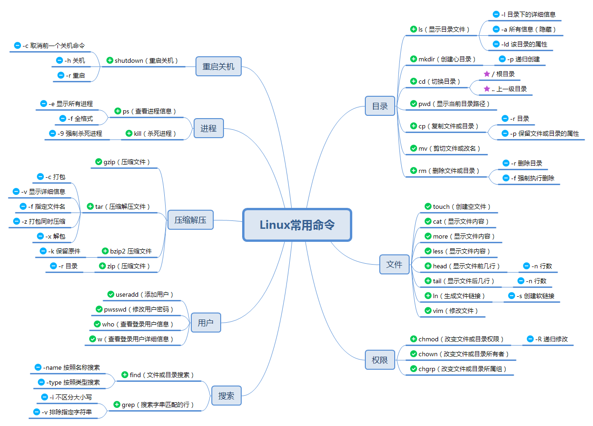

南京中医药大学 人工智能与信息技术学院

# Linux 

## 目录  

1. [Linux的介绍和安装](#Linux的介绍和安装)
2. [Linux常用命令](#Linux常用命令)
3. [Shell编程](#Shell编程)

## Linux的介绍和安装

Linux由林纳斯·托瓦兹于1991年开发，旨在创建一个开放源代码的操作系统。从最初的单用户系统发展为支持多种硬件架构的强大平台，广泛应用于服务器、桌面和嵌入式设备。  

- **开源软件的定义和意义**

开源软件是指源代码公开，允许用户自由使用、修改和分发的软件。
这种软件通常通过社区参与不断改进，促进了技术的创新与共享。  

- **Linux的内核版和发行版**  

&nbsp;&nbsp;&nbsp;&nbsp;内核版  

&nbsp;&nbsp;&nbsp;&nbsp;Linux内核是操作系统的核心，版本以“X.Y.Z”格式命名。各个版本不断更新，以增强功能和安全性。  

&nbsp;&nbsp;&nbsp;&nbsp;发行版  

&nbsp;&nbsp;&nbsp;&nbsp;发行版包括内核及其相关软件，常见版本有：  

&nbsp;&nbsp;&nbsp;&nbsp;**Ubuntu**：友好，适合初学者。  
&nbsp;&nbsp;&nbsp;&nbsp;**Fedora**：追求最新技术，适合开发者。  
&nbsp;&nbsp;&nbsp;&nbsp;**Debian**：稳定，适合生产环境。  
&nbsp;&nbsp;&nbsp;&nbsp;**Arch Linux**：高度自定义，适合高级用户。  

- **Linux的安装步骤**  

1. 选择合适的发行版并下载ISO文件。  
2. 下载合适的虚拟机软件。  
3. 创建新的虚拟机并加载ISO文件。  
4. 按照安装向导完成安装过程。 

## Linux常用命令

  

    

  

  
  
    
    
  

  

## Shell编程

社区与支持  

Linux拥有活跃的社区，用户可在以下平台寻找支持与帮助：  

- **论坛**：如Arch Wiki、Ubuntu Forums。  
- **Stack Overflow**：技术问答社区。  
- **官方文档**：各发行版提供的用户手册和文档。
