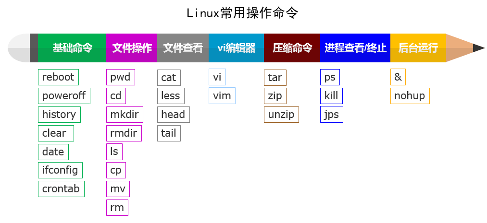

南京中医药大学 人工智能与信息技术学院

# Linux 

## 目录  

1. [Linux的介绍和安装](#Linux的介绍和安装)  
2. [Linux常用命令](#Linux常用命令)  
3. [Shell编程](#Shell编程)
4. [正则表达式](#正则表达式)  


## Linux的介绍和安装

&nbsp;&nbsp;&nbsp;&nbsp;Linux由林纳斯·托瓦兹于1991年开发，旨在创建一个开放源代码的操作系统。

&nbsp;&nbsp;&nbsp;&nbsp;从最初的单用户系统发展为支持多种硬件架构的强大平台，广泛应用于服务器、桌面和嵌入式设备。  

### 开源软件和GNU协议的定义和意义

&nbsp;&nbsp;&nbsp;&nbsp;开源软件是指源代码公开，允许用户自由使用、修改和分发的软件。

&nbsp;&nbsp;&nbsp;&nbsp;这种软件通常通过社区参与不断改进，促进了技术的创新与共享。  

&nbsp;&nbsp;&nbsp;&nbsp;GNU（GNU's Not Unix!）是一个自由软件项目，旨在创建一个完全自由的操作系统。

&nbsp;&nbsp;&nbsp;&nbsp;GNU项目由理查德·斯托曼（Richard Stallman）于1983年发起。与GNU相关的最重要的许可证是GNU通用公共许可证（GPL）。

### Linux的开发模式

&nbsp;&nbsp;&nbsp;&nbsp;**开源（Open Source）**：Linux内核及其大部分组件的源代码都是开放的，任何人都可以查看、修改和分发。开源理念鼓励社区的参与和创新。

&nbsp;&nbsp;&nbsp;&nbsp;**社区驱动（Community-Driven）**：Linux的开发和维护依赖于一个全球范围的开发者社区。这个社区包括个人开发者、企业贡献者和各种组织，大家通过邮件列表、论坛和其他协作平台共同合作。

&nbsp;&nbsp;&nbsp;&nbsp;**模块化（Modularity）**：Linux系统采用模块化设计，内核由多个模块组成，这使得功能可以以模块的形式加载和卸载，便于管理和优化系统性能。

&nbsp;&nbsp;&nbsp;&nbsp;**版本控制（Version Control）**：Linux的开发通常使用Git等版本控制系统，这使得多个人可以在同一项目上进行协作，便于管理代码的变化和更新。

&nbsp;&nbsp;&nbsp;&nbsp;**持续集成和持续发布（CI/CD）**：Linux的发展采用了持续集成和持续发布的模式，各个版本不断更新，以增强功能、修复漏洞和提高性能。

&nbsp;&nbsp;&nbsp;&nbsp;**遵循标准（Standards Compliance）**：Linux遵循POSIX等标准，确保兼容性和可移植性，使得Linux应用程序能够在不同的系统上运行。


### Linux的内核版和发行版

&nbsp;&nbsp;&nbsp;&nbsp;**内核版**  

&nbsp;&nbsp;&nbsp;&nbsp;Linux内核是操作系统的核心，版本以“X.Y.Z”格式命名。各个版本不断更新，以增强功能和安全性。  

&nbsp;&nbsp;&nbsp;&nbsp;Linux内核由芬兰计算机科学家林纳斯·托瓦兹（Linus Torvalds）于1991年首次发布。最初版本为0.01，作为替代Minix操作系统的个人项目。

&nbsp;&nbsp;&nbsp;&nbsp;**发行版**  

&nbsp;&nbsp;&nbsp;&nbsp;发行版包括内核及其相关软件，常见版本有：  

&nbsp;&nbsp;&nbsp;&nbsp;**Ubuntu**：友好，适合初学者。  

&nbsp;&nbsp;&nbsp;&nbsp;**Fedora**：追求最新技术，适合开发者。  

&nbsp;&nbsp;&nbsp;&nbsp;**Debian**：稳定，适合生产环境。  

&nbsp;&nbsp;&nbsp;&nbsp;**Arch Linux**：高度自定义，适合高级用户。  

&nbsp;&nbsp;&nbsp;&nbsp;`lsb_release -a` 是一个在 Linux 系统中用于显示 Linux 发行版信息的命令。

&nbsp;&nbsp;&nbsp;&nbsp;运行 `lsb_release -a` 命令后，将输出以下信息：

&nbsp;&nbsp;&nbsp;&nbsp;**Distributor ID**: 显示发行版的名称，例如 Ubuntu、Debian、CentOS 等。
&nbsp;&nbsp;&nbsp;&nbsp;**Description**: 显示详细的发行版描述信息，通常包括版本号和发行版名称。
&nbsp;&nbsp;&nbsp;&nbsp;**Release**: 显示具体的版本号，例如 20.04、7.9 等。
&nbsp;&nbsp;&nbsp;&nbsp;**Codename**: 显示发行版的代号，例如 Ubuntu 的 LTS 版本可能是 "Focal Fossa" (20.04) 或 "Bionic Beaver" (18.04)。

### Linux的安装步骤

1. 选择合适的发行版并下载ISO文件。  
2. 下载合适的虚拟机软件。  
3. 创建新的虚拟机并加载ISO文件。  
4. 按照安装向导完成安装过程。 


## Linux常用命令

<div style="display: flex; justify-content: center;">  

    

</div>  

<div style="display: flex; justify-content: center;">  
  
    
  
</div>  


## Shell编程

1. **Shell 变量**  
   Shell变量用于存储信息，便于在脚本中重复使用。  

2. **Shell 传递参数**  
   可以通过位置参数（如 `$1`、`$2`）在脚本中接收外部传递的参数。  

3. **Shell 数组**  
   Shell支持一维数组，允许存储多个值，以便于批量处理和数据管理。  

4. **Shell 运算符**  
   Shell提供多种运算符，如算术运算符、比较运算符和逻辑运算符，用于进行各种计算和判断。  

5. **Shell echo命令**  
   `echo`命令用于在终端输出文本或变量内容，常用于调试和信息显示。  

6. **Shell printf命令**  
   `printf`命令提供格式化输出功能，可以控制文本的显示格式，适用于需要精确格式的输出。  

7. **Shell test 命令**  
   `test`命令用于条件判断，评估表达式的真或假，通常与if语句结合使用。  

8. **Shell 流程控制**  
   流程控制结构（如if、for、while）用于控制脚本执行的流程，以实现不同的逻辑分支。  

9. **Shell 函数**  
   函数是可以重复调用的代码块，有助于提高代码的重用性和模块化。  

10. **Shell 输入/输出重定向**  
    输入/输出重定向允许将命令的输入和输出重定向到文件或其他命令，实现更灵活的数据管理。
    
## 正则表达式

正则表达式（Regular Expression）是一种用于匹配字符串的模式，广泛应用于文本处理和数据验证。在Linux中，正则表达式常用于工具如 `grep`、`sed`、`awk`等。  

### 基本语法  

1. **字符匹配**  
   - `.`: 匹配任意单个字符。  
   - `[]`: 匹配括号内的任意单个字符，例如 `[abc]` 匹配 `a`、`b` 或 `c`。  

2. **特殊字符**  
   - `\`: 转义字符，用于匹配特殊字符本身，例如 `\$` 匹配 `$` 字符。  
   - `^`: 匹配行的开始。  
   - `$`: 匹配行的结束。  

3. **数量词**  
   - `*`: 匹配前一个字符零次或多次。  
   - `+`: 匹配前一个字符一次或多次。  
   - `?`: 匹配前一个字符零次或一次。  
   - `{n}`: 精确匹配前一个字符 n 次。  
   - `{n,}`: 匹配前一个字符 n 次或多次。  
   - `{n,m}`: 匹配前一个字符至少 n 次，但不超过 m 次。  

4. **逻辑操作**  
   - `|`: 用于表示“或”逻辑，例如 `a|b` 匹配 `a` 或 `b`。  

### 常用命令  

- **grep**  
  在文件中搜索匹配正则表达式的行：  
  ```bash  
  grep '正则表达式' 文件名


